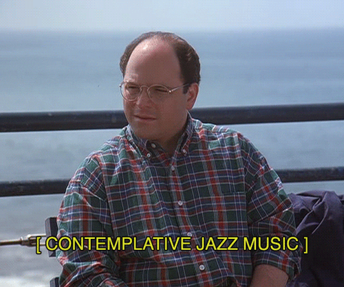

# Music Addict 2

A clicker game for audionauts that can be played in your web-browser.

**CURRENTLY SOME THINGS ARE STILL WORK IN PROGRESS.**



---

## Development Motivation

It's a JavaScript learning project.

---

## Game Story

You're broke and lonely. After many sleepless nights in your nearly empty 1-room flat, you decide to spend your last 7◈ to buy music. "At least my funeral will have a good soundtrack", you think.

---

## Usage Requirements

- Internet connection. 3G or higher speeds recommended.
- Web-browser [supporting ES6](https://caniuse.com/es6).

---

## Getting Into The Game

To begin, open your web-browser an go to: <https://etrusci.org/play/musicaddict2>

### First Time Players

This will give you a new **Secret Token** and put you into the game. **Store it somewhere safe. It can not be recovered.** Although the app will remember it by storing it in the local storage of your web-browser (if available), and will enter it for you when you return (so you can just click the **CONTINUE** button), this is bound to the current device your on and may get lost if you clear all your browser data. Better you store it somewhere safe.

1. Enter a **Player Name** (can be changed later) or leave it empty to play as *Anonymous*.
2. Click the **REGISTER** button.

### Returning Players

This will load your previous progress and put you into the game.

1. Enter your **Secret Token**.
2. Click the **Continue** button.

---

## Playing The Game

In a nutshell: click the **PROGRESS** button a lot. What happens follows specific rules. It also depends on what happened before, sometimes passed time, and luck.

Your progress will be auto-saved every now and then, or when you click the **EXIT** button.

---

<!--

## Hosting The Game

This guide is just raw/WIP.

For this guide it's assumed that the following directory structure is created on the web-server:

    public/
      musicaddict2/
        lib/
          api.php
          app.js
          main.js
          shared.php
        res/
          actiongif/
          css/
          font/
        api.php
        index.html
    protected/
      musicaddict2-data/
        db.sqlite3

### Download The Code

From GitHub.

### Create Root Directory

Create musicaddict2/ dir on your web-server inside of the public webroot.

### Create Data Directory

Create data/ dir on your web-server **outside of the public webroot**.

### Create Database File

Use dev/bin/sqlite3.exe and dev/sql/db-schema.sql to create the database file db.sqlite3 and upload it to the previously created data/ dir.

-->

<!--
### Upload contents of dist/web/ to /musicaddict2 on your web-server

### Give webserver+php r+w perm for data/ dir

### Give webserver+php r+w perm for the data/db.sqlite3 file

### Configuration

#### Edit dist/web/api.php

Change **$querySrc** to **'post'** if you don't plan to develop the API further. It's just nifty to being able to send test data also tru GET while developing.

```php
$API = new MusicAddictAPI(
    $querySrc='post',
    $databaseFile='/path/to/data/db.sqlite3'
);
```

Change **$databaseFile** to an absolute path that points to the data/ dir you've created earlier.

#### Edit dist/web/lib/app.js

Only required if you move index.html or dist/web/lib dir to another location.

Adjust the apiPath configuration value. Make it relative from dist/web/index.html.

```javascript
const MusicAddict2 = {
    conf: {
        apiPath: './api.php',
    }
}
```

Adjust the paths for the CSS and script files.

```html
<link rel="stylesheet" href="path/to/dist/web/res/css/app.min.css">
<script src="path/to/dist/web/lib/app.js"></script>
<script src="path/to/dist/web/lib/main.js"></script>
``` -->

<!--
*If you want to know more what happens before you begin, read the spoilers section below.*

## Spoilers

You start with 7◈ cash. Since you're addicted to music, you'll never stop digging for more records. Sometimes you discover a very interesting one, and buy it, just to go right back to digging.

After a while someone may offer you cash for a record in your collection, and you sell it for profit.

With more cash comes the ability/chance to buy higher priced records, and thus make better profits when selling.

After a while you'll have enough cash to upgrade your **click speed**. Do it. More clicks mean more chances for good luck/profit.

-->
